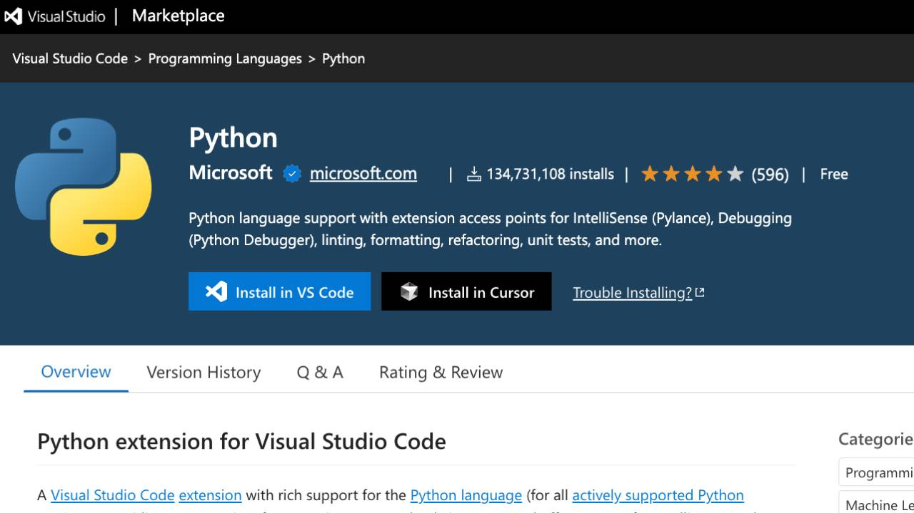

# Install to Cursor button for VS Marketplace

This extension adds an install to Cursor button to the Visual Studio Code Marketplace page

### Usage

1. Download the zip file from [releases](https://github.com/ekinertac/vscode-to-cursor-extension-link/releases/tag/v0.1) page.
2. Go to your browser's extensions page by navigating to `chrome://extensions/` in the address bar. (replace chrome if you're using another chrome based browser)
3. Enable "Developer mode" by toggling the switch in the top right corner.
4. Click on the "Load unpacked" button and select the downloaded zip file.
5. The extension should now be installed and active.

### Features

- Adds an "Install in Cursor" button next to the "Install in VS Code" button on the Visual Studio Code Marketplace page.
- The "Install in Cursor" button will open extension page directly into the Cursor editor.
